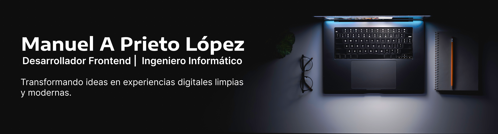

  

---

## 🚀 Sobre mí

Soy desarrollador frontend con más de 3 años de experiencia. Me encanta crear interfaces que no solo se vean bien, sino que realmente se sientan bien al usarlas. Trabajo con tecnologías como React, TypeScript, Tailwind CSS entre otras, siempre buscando el equilibrio entre diseño, usabilidad y buen código. Creo en el aprendizaje constante y en hacer que cada línea de código cuente para el usuario final.

---

## 🛠 Tecnologías principales

  

---

## 🌐 Conecta conmigo

- 🔗 [LinkedIn](https://www.linkedin.com/in/maplop)
- 🌍 [Portafolio](#)

---

  ✨ Siempre aprendiendo. Siempre construyendo.

