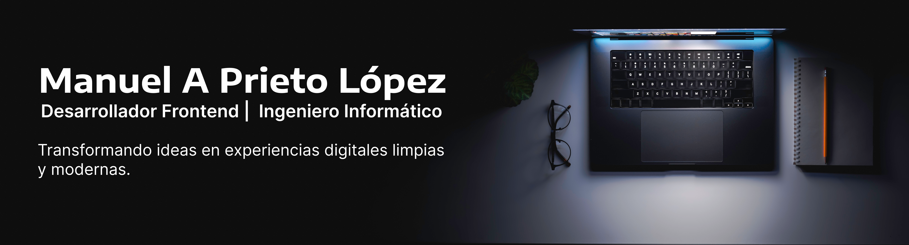

<div align="center">



<br/>

<a href="https://git.io/typing-svg">
  
</a>

<br/>


[](https://www.linkedin.com/in/maplop)
[](https://maplop-portfolio.vercel.app)

</div>

<br/>

## 🧭 Sobre mí

```ts
const manuel = {
  rol: "Ingeniero Informático & Frontend Developer",
  experiencia: "+3 años",
  ubicacion: "🌍 España",
  stack: ["React", "TypeScript", "Tailwind CSS", "Next.js", "Astro"],
  enfoque: "Convertir diseños en interfaces interactivas, limpias y con propósito",
  filosofia: "El buen código se siente tan bien como se ve",
};
```

Me apasiona la intersección entre **diseño** e **ingeniería**: construir productos donde cada detalle —desde la animación de un botón hasta la arquitectura del componente— tenga sentido. Creo firmemente en el **aprendizaje continuo**, el **código limpio** y en escribir software pensando siempre en quien lo usa.

<br/>

## 🛠 Stack principal

<div align="center">


</div>

<br/>

## 📊 Estadísticas

<div align="center">


<br/>


<br/>


</div>

> ⚠️ Nota: sustituye `maplop` en las URLs de arriba por tu **usuario real de GitHub** para que las tarjetas se generen con tus datos correctos.

<br/>

## 🐍 Mi actividad, en modo Snake

<div align="center">
  
</div>

> Esta animación se genera automáticamente con GitHub Actions ([platane/snk](https://github.com/Platane/snk)). Te dejo el workflow listo más abajo para activarla en tu propio repo.

<br/>

## 💡 Filosofía de trabajo

<table align="center">
<tr>
<td align="center" width="33%">🎯<br/><b>Precisión al píxel</b><br/><sub>Cada detalle visual importa</sub></td>
<td align="center" width="33%">⚡<br/><b>Rendimiento primero</b><br/><sub>Interfaces rápidas y accesibles</sub></td>
<td align="center" width="33%">🧩<br/><b>Código escalable</b><br/><sub>Componentes limpios y reutilizables</sub></td>
</tr>
</table>

<br/>

## 🌐 Conecta conmigo

<div align="center">

[](https://www.linkedin.com/in/maplop)
[](https://maplop-portfolio.vercel.app)

</div>

<br/>

<div align="center">

✨ *Siempre aprendiendo. Siempre construyendo.* ✨

</div>
